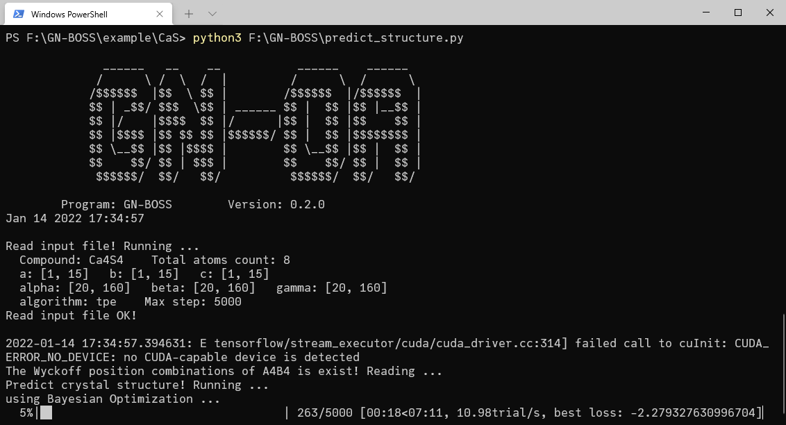

# GN-OA
　　GN-OA is a crystal structure prediction tool, which can
predict crystal structures from scratch with extremely low computational
cost.

　　In GN-OA a graph network (GN) is adopted to establish a
correlation model between the crystal structure and formation
enthalpies, and optimization algorithm (OA) is used to accelerate the
search for crystal structure with optimal formation enthalpy. The
approach of combining GN and OA for crystal structure searching
(GN-OA) can predict crystal structures at given chemical compositions
with additional constraints on cell shapes and lattice
symmetries.
    
## System requirements
- Python >= 3.6
- pymatgen >= 2020.8.3
- tensorflow >= 2.3.0
- megnet >= 1.1.8
- hyperopt >= 0.2.4
- sko(scikit-opt) >= 0.6.1

## Download
- Version: 0.2.0 [Download GN-OA](http://www.comates.group/download?filename=GN-OA_0.2.0.zip)

## Getting started
#### 1. Training the GN model
- (1) Data preparation
    - a) MatBench dataset
    
        See the file `./data/matbench_dataset.py`
    
    - b) OQMD
    
        If you want to use OQMD, you need to download the database first. [Download](http://www.oqmd.org/download/)

- (2) Training the GN model

　　We provided the origin MEGNet model in `./NN_model/orig_megnet.py`, you just need to run this python file to get a trained GN model.

　　Of course, you can also build a new GN model.

#### 2. Crystal structure prediction

- (1) Input file `gnoa.in`

    ``` python
    [BASE]
    # The chemical formula of the compound, element symbol + count, i.e., Ca4 S4, Cs1 Pb1 I3
    compound = Ca4 S4
    # The GN model file path, it is better to use absolute path.
    gn_model_path = /GN/model/path
    # Output path, use to save the results.
    output_path = .
    # Load model and predict using GPU
    use_gpu = False
    
    [LATTICE]
    # The range of space group:
    # [A, B]-> A<=sg<=B
    space_group = [2, 230]
    # Lattice a,b,c (unit: Angstrom):
    # [A, B] -> A<=Lattice<=B
    lattice_a = [2, 30]
    lattice_b = [2, 30]
    lattice_c = [2, 30]
    # Lattice alpha,beta,gamma (unit: degree):
    # [A, B] -> A<=Lattice<=B
    lattice_alpha = [20, 160]
    lattice_beta = [20, 160]
    lattice_gamma = [20, 160]
    
    [PROGRAM]
    # Search algorithm: 
    #  1) 'tpe' (Bayesian Optimization); 
    #  2) 'pso' (Particle Swarm Optimization)
    #  3) 'rand' (Random Search); 
    algorithm = tpe
    # 1) If `algorithm = tpe`, `n_init` is the number of initial random points;
    # 2) If `algorithm = pso`, `n_init` is the number of particle;
    # 3) If `algorithm = rand`, `n_init` is invalid.
    n_init = 200
    # The maximum steps of program runs
    # 1) If `algorithm = tpe`, `max_step` is the maximum steps of program runs;
    # 2) If `algorithm = pso`, `max_step` is the maximum iterations;
    # 3) If `algorithm = rand`, `max_step` is the maximum steps of program runs.
    max_step = 5000
    # Specify the random seed, -1 is None
    rand_seed = 100
    ```
- (2) Search crystal structure

    Run the `predict_structure.py` file in the path where the input file `gnoa.in` localed:
    
    ```shell
    cd [/input/file/path]
    python [/the/project/path]/predict_structure.py
    ```
  
    <p align="center">
    
    </p>

## Cite

　　If you use GN-OA for research, please consider citing our paper.
